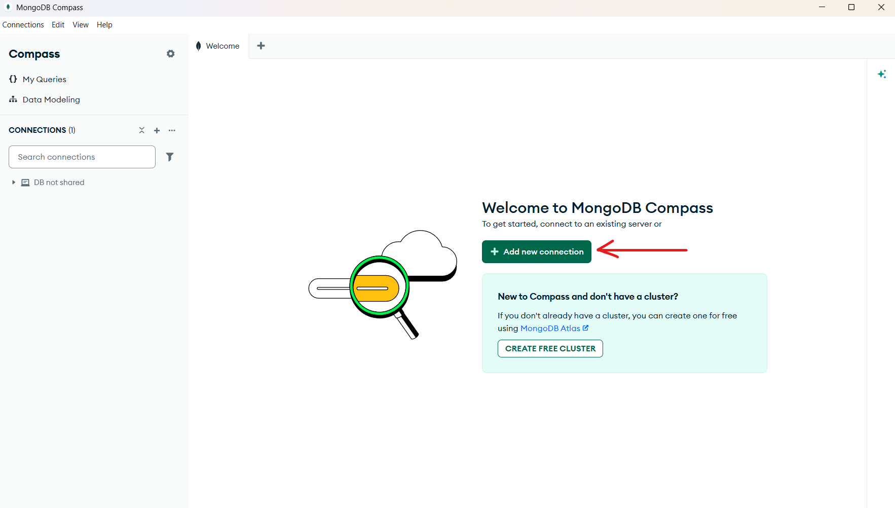
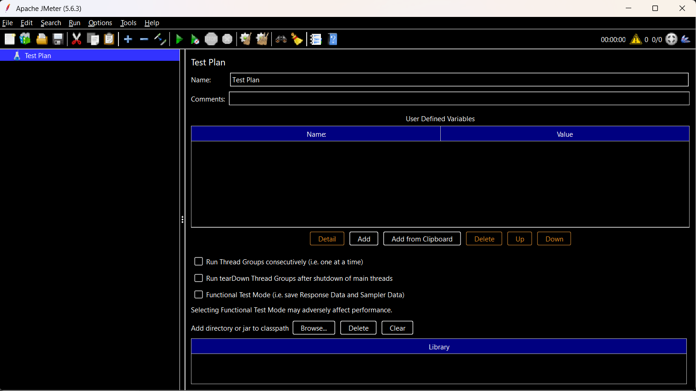
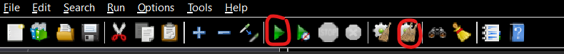

# CBD-MongoDB

## Manual para la instalación de MongoDB

Para instalar MongoDB se puede seguir la guía hecha por profesores de la Escuela Tecnica Superior de Ingeniería Informatica de la Universidad de Sevilla:

[Guía de Instalación](files-readme/CBD-L02-Instalación%20MongoDB.v.1.0.3.pdf)

Una vez tengamos instalado MongoDB, crearemos nuestra conexión. Abriremos MongoDB Compass y una terminal con MongoDB Shell. Una vez abierto MongoDB Compass, pulse el boton que se indica en la imagen



Añada el nombre (se recomienda no cambiar la URI, si lo hace, acuerdese de cambiarla cuando se le indique)

Luego de eso, nos instalaremos las Database Tools de MongoDB para añadir datos de prueba:

```bash
brew tap mongodb/brew
brew install mongodb-database-tools
```

Luego ejecutaremos los siguientes comandos (este proceso tardara un rato debido a que es un archivo muy pesado):

**ATENCIÓN** Si usted ha cambiado al URI, cambie el segundo comando donde aparece "27017" por su puerto.

```bash
curl https://atlas-education.s3.amazonaws.com/sampledata.archive -o sampledata.archive
mongorestore --archive=sampledata.archive --port 27017
```

## Manual para la instalación del proyecto Python

Para instalar este proyecto, ejecute los siguientes comandos:

```bash
git clone https://github.com/Miguelgarviz/CBD-MongoDB.git 
cd CBD-MongoDB
python -m venv venv
.\venv\Scripts\activate
pip install -r requirements.txt
```

Recuerde activar siempre el entorno virtual de python cada vez que entre de nuevo en el proyecto.

```bash
.\venv\Scripts\activate
```

## Manual para instalar Docker

Solo tiene que instalarse [Docker Desktop](https://docs.docker.com/desktop/setup/install/windows-install/)

## Manual para instalar JMeter

Ir a la siguiente [dirección de descarga](https://jmeter.apache.org/download_jmeter.cgi)

Descarge la versión .zip del Binaries

Luego de descomprimir el archivo, en la carpeta /bin ejecute el archivo jmeter.bat (Puede crear un acceso directo si quiere)

Se le abrira la siguiente pestaña:



Haga click derecho sobre Test Plan y pulse Add>Threads (Users)>Thread Group

En este añada los siguientes datos en los siguientes campos:

**Number of Threads (users)** --> 1000
**Ramp-up period (seconds)** --> 5
**Loop Count** --> 1 (Deseleccione *Infinite*)

Luego de esto, pulse click derecho sobre Thread Group y añada Add>Sampler>OS Process Sampler

Una vez añadido, cambie los siguientes bloques:

**Command**: Dirección dentro del venv de su proyecto donde esta el archivo Python.exe (debería de estar dentro de la carpeta Scripts)
**Working directory**: Carpeta *mongo-not-sharded* o *mongo-sharding* del proyecto (dependiendo de que tipo de sistema quiera probar)

En command parameters, añadir el archivo que se quiera ejecutar: *not_sharded_search.py* o *sharded_search.py*


Activar la casilla *Check Return Code Expected Return Code: 0*

Luego de configurar el OS Process Sampler, añadir los siguientes Listeners pulsando click derecho sobre Thread Group Add>Listeners>*

**View Resuls in Table**
**Aggregate Graph**
**Summary Report**
**View Results Tree**

Dentro de *View Results in Table*, añadir en el campo *Filename* lo siguiente:

Dirección del proyecto + *mongo-not-sharded\results\not_sharded_results.csv* o *mongo-sharing\results\shared_results.csv* dependiendo de las pruebas que quiera ejecutar

## Manual de Shardind

Es necesario tener Docker instalado.

**ATENCIÓN** La versión del proyecto actual contiene un docker-compose con 3 shards, si se quiere probar con menos, primero comente o borre uno de los shards y luego siga con esta guia

Ejecutar los siguientes comandos en la raiz del proyecto:

```bash
docker-compose up -d
```

Para iniciar el config:

```bash
docker exec -it mongo-config mongosh --eval 'rs.initiate({_id: "rs-config", configsvr: true, members: [{_id: 0, host: "configsvr:27017"}]})'
```

Para configurar cada shard, hacer esto por cada partición que se quiera añadir.

```bash
docker exec -it mongo-shard1 mongosh --eval "rs.initiate({_id: 'rs-shard1', members: [{_id: 0, host: 'shard1:27017'}]})"
docker exec -it mongo-router mongosh --eval 'sh.addShard("rs-shard1/shard1:27017")'
```

Modificar el shard1 por el nombre del shard a añadir

Ahora configuraremos el router

**ATENCIÓN** Esto usa los datos de prueba instalados anteriormente, si se esta usando otra base de datos y/o otra colección, cambie los nombres de estas por los suyos (db= "sample_airbnb", collection="listingsAndReviews")
```bash
docker exec -it mongo-router mongosh
sh.enableSharding("sample_airbnb");
use sample_airbnb;
db.listingsAndReviews.createIndex({ "_id": "hashed" });
sh.shardCollection("sample_airbnb.listingsAndReviews", { "_id": "hashed" });
```

El puerto del router es el indicado en el docker-compose.yml (27020)

Ademas, se dispone de un contendor aislado del distribuido por si quiere usarlo como versión no distribuida, aunque puede seguir usando la versión por defecto de la base de datos para esto tambien.
## Manual para ejecución de las pruebas

Suponiendo que se tiene todo configurado correctamente (especialmente JMeter coincida todas las carpetas y rutas y configuraciones para las pruebas), solo se tiene que pulsar el Boton verde de JMeter play

A la hora de volver a ejecutar las pruebas, tendra que borrar los datos de los csv que se han rellenado, salvo que el csv que se vaya a rellenar ya este vacio. Ademas, debera pulsar el boton de limpieza de JMeter para no ensuciar los datos con otros anteriores.



Si surgiese cualquier problema y no se sepa como solucionar, se puede acceder a esta [conversación con Gemini](https://gemini.google.com/share/1b6eb5c55262) que puede ayudarle.

## Manual para creación de graficas

En el proyecto, abra una terminal:

Si quiere generar graficas de las pruebas del sistema no distribuido
```bash
python mongo-not-sharded/generate-graphics.py
```

Si quiere generar graficas de las pruebas del sistema distribuido
```bash
python mongo-sharding/generate-graphics.py
```

Si se quiere generar las graficas de comparación entre distribuido y no distribuido
Si quiere generar graficas de las pruebas del sistema no distribuido
```bash
python generate-graphics-combined.py
```

Si se quiere generar graficas comparando varios nodos, se necesita varios csv en la carpeta de *mongo-sharding/results*, y modificar las rutas dentro del archivo *sharded_comparative_graphic.py*

Luego ejecutar el comando
Si quiere generar graficas de las pruebas del sistema no distribuido
```bash
python sharded_comparative_graphic.py
```

**ATENCIÓN** Cada vez que se genera una gráfica, se sobreescribira en el anterior a menos que cambie el nombre de esta gráfica generadas en las carpetas de *graphics*